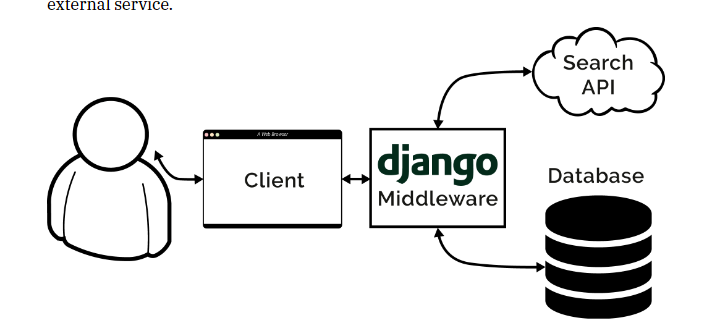

# virtual env and Django basic

## Django框架

一个高级的，功能丰富的web框架。

​​

* web框架

  * 请求体

    ​`https://otheve.beacon.qq.com/analytics/v2_upload?appkey=0WEB0OEX9Y4SQ244`​

    * ?：分割了请求路径（路由router）与请求参数的分割。
    * ？后面的&符多个参数
  * 路由
  * 模板引擎（前端界面）
  * 会话管理session
  * 安全管理 csrf
  * 中间件（包含一些自定义逻辑）
* 数据库：sqlite，mysql，postgresql， oracle （**SQL语句**）

  * ER图：Entity， Attribute, Relationship(1:1, 1:n, m:n)

    * 1:1: 一对一关系通常通过在一个表中添加另一个表的主键作为 外键来实现。

      ```sql
      create table Category(
      id int primary key
      name varchar not null
      )
      ```

* 虚拟环境virtualenv

  * 隔离项目依赖
  * 避免系统环境污染
  * 方便部署和资源管理
* python包管理工具

## 安装Django

### Django的生命周期

* **接受请求**：**wsgi**，django自带的轻量服务器，`runserver`​
* **URL解析**： **urls.py** 请求映射分发
* **中间件Middleware**： 在请求进入视图之前。常见的任务身份验证，安全防护，日志记录
* **视图处理View**： 视图执行我们自定义的函数逻辑，查询db，处理表单.....最终返回一个http响应。
* **模板渲染**（template）：返回一个html，根据view的处理结果，动态生成一个html页面。（只有前后端不分离的时候会渲染，如果分离的话，view会直接返回httpresponse给前端。）
* 最终返回
* 中间件Middleware

### ORM

‍
